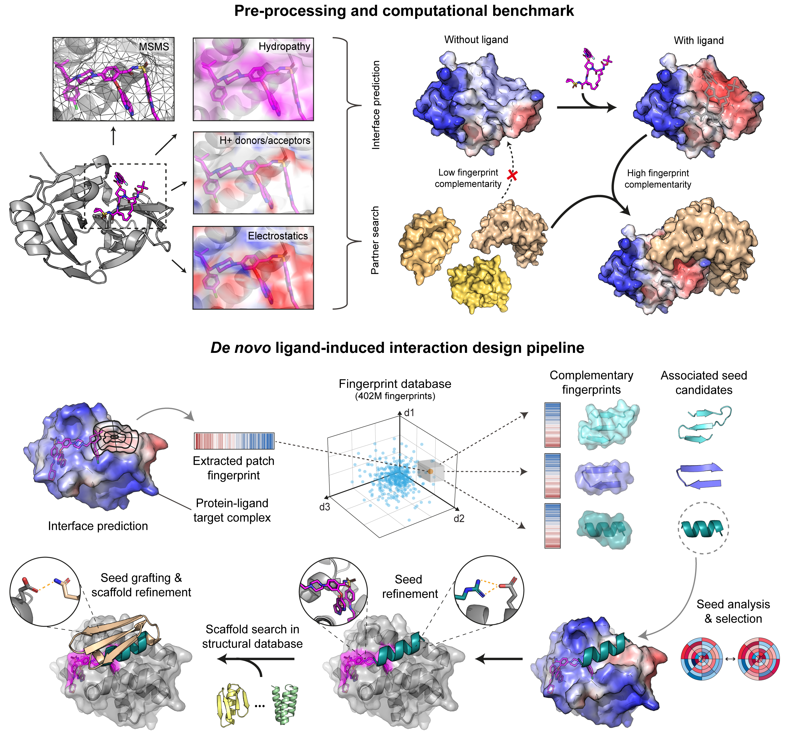

<h1 style="text-align: center;">
  MaSIF-neosurf  
  
  _Surface-based protein design for ternary complexes_
</h1>


Code repository for ["Targeting protein-ligand neosurfaces with a generalizable deep learning tool"](citation.bib).

[](https://doi.org/10.1038/s41586-024-08435-4)

## Table of Contents

- [Description](#description)
- [Method overview](#method-overview)
- [System requirements](#system-requirements)
- [Installation with Docker](#installation-with-docker)
- [Preprocessing a PDB file](#preprocessing-a-pdb-file)
- [Running a search](#running-a-search)
- [PyMOL plugin](#pymol-plugin)
- [Computational binder recovery benchmark](#computational-binder-recovery-benchmark)
- [Running a seed search](#running-a-seed-search)
- [Running a seed refinement and grafting](#running-a-seed-refinement-and-grafting)
- [License](#license)
- [Reference](#reference)

## Description

Molecular recognition events between proteins drive biological processes in living systems. However, higher levels of mechanistic regulation have emerged, where protein-protein interactions are conditioned to small molecules. Here, we present a computational strategy for the design of proteins that target neosurfaces, i.e. surfaces arising from protein-ligand complexes. To do so, we leveraged a deep learning approach based on learned molecular surface representations and experimentally validated binders against three drug-bound protein complexes. Remarkably, surface fingerprints trained only on proteins can be applied to neosurfaces emerging from small molecules, serving as a powerful demonstration of generalizability that is uncommon in deep learning approaches. The designed chemically-induced protein interactions hold the potential to expand the sensing repertoire and the assembly of new synthetic pathways in engineered cells.

## Method overview



## System requirements
### Hardware
MaSIF-seed has been tested on Linux, and it is recommended to run on an x86-based linux Docker container. It is possible to run on an M1 Apple environment but it runs much more slowly. To reproduce the experiments in the paper, the entire datasets for all proteins consume several terabytes.

Currently, MaSIF takes a few seconds to preprocess every protein. We find the main bottleneck to be the APBS computation for surface charges, which can likely be optimized. Nevertheless, we recommend a distributed cluster to preprocess the data for large datasets of proteins.

### Software
MaSIF relies on external software/libraries to handle protein databank files and surface files, 
to compute chemical/geometric features and coordinates, and to perform neural network calculations. 
The following is the list of required libraries and programs, as well as the version on which it was tested (in parentheses).
* [Python](https://www.python.org/) (3.6)
* [reduce](http://kinemage.biochem.duke.edu/software/reduce.php) (3.23). To add protons to proteins. 
* [MSMS](http://mgltools.scripps.edu/packages/MSMS/) (2.6.1). To compute the surface of proteins. 
* [BioPython](https://github.com/biopython/biopython) (1.66). To parse PDB files. 
* [PyMesh](https://github.com/PyMesh/PyMesh) (0.1.14). To handle ply surface files, attributes, and to regularize meshes.
* PDB2PQR (2.1.1), multivalue, and [APBS](http://www.poissonboltzmann.org/) (1.5). These programs are necessary to compute electrostatics charges.
* [Open3D](https://github.com/IntelVCL/Open3D) (0.5.0.0). Mainly used for RANSAC alignment.
* [Tensorflow](https://www.tensorflow.org/) (1.9). Use to model, train, and evaluate the actual neural networks. Models were trained and evaluated on a NVIDIA Tesla K40 GPU.
* [StrBioInfo](https://pypi.org/project/StrBioInfo/). Used for parsing PDB files and generate biological assembly for MaSIF-ligand.
* [Dask](https://dask.org/) (2.2.0). Run function calls on multiple threads (optional for reproducing some benchmarks).
* [Pymol](https://pymol.org/2/) (2.5.0). This optional program allows one to visualize surface files.
* [RDKit](https://www.rdkit.org/) (2021.9.4). For handling small molecules, especially the proton donors and acceptors.
* [OpenBabel](https://github.com/openbabel/openbabel) (3.1.1.7). For handling small molecules, especially the conversion into MOL2 files for APBS.
* [ProDy](https://github.com/prody/ProDy) (2.0). For handling small molecules, especially the ligand extraction from a PDB.

## Installation with Docker
MaSIF is written in Python and does not require compilation. Since MaSIF relies on a few external programs (MSMS, APBS) and libraries (PyMesh, Tensorflow, Scipy, Open3D), we strongly recommend you use the Dockerfile and Docker container. Setting up the environment should take a few minutes only. 
```bash
git clone https://github.com/LPDI-EPFL/masif-neosurf.git
cd masif-neosurf
docker build . -t masif-neosurf 
docker run -it -v $PWD:/home/$(basename $PWD) masif-neosurf 
```

## Preprocessing a PDB file

Before we can search for complementary binding sites/seeds, we need to triangulate the molecular surface and compute 
the initial surface features. The script `preprocess_pdb.py` takes two required positional arguments: the PDB file and a 
definition of the chain(s) that will be included.
If a small molecule is part of the molecular surface, we need to tell MaSIF-neosurf where to find it in the PDB file 
(three letter code + chain) using the `-l` flag. Optionally, we can also provide an SDF file with the `-s` flag that 
will be used to infer the correct connectivity information (i.e. bond types). This SDF file can be downloaded from the 
PDB website for example.
Finally, we must specify an output directory with the `-o` flag, in which all the preprocessed files will be saved.


```bash
# with ligand
python -W ignore preprocess_pdb.py example/4dri.pdb 4DRI_A -l RAP_A -o example/processed

# without ligand
python -W ignore preprocess_pdb.py example/4dri.pdb 4DRI_B -o example/processed
```

### Known limitations
- The ligand processing pipeline fails for some ligands. In many cases, this can be fixed by manually modifying the created mol2 file and providing it explicitly using the `-m` flag.
- Ligands with component identifier codes longer than 3 letters are currently not supported.


## Running a search

The script `masif_search.py` performs a search against a database with already pre-processed protein surfaces.
As an example, the command below searches for complementary surface patches against a mini database that only contains the input complex itself and its binder (make sure to run the preprocessing commands above before running the search). 

```bash
python -W ignore masif_search.py \
    --target_dir example/processed \
    --target 4DRI_A \
    --resid 201 --chain A --atom_id C20 \
    --cutoff 5.0 \
    --database example/processed \
    --out_dir example/search_results
```


## PyMOL plugin

The [PyMOL plugin](masif_pymol_plugin.py) can be used to visualize preprocessed surface files (.ply file extension).
To install it, open the plugin manager in PyMOL, select `Install New Plugin -> Install from local file` and choose the `masif_pymol_plugin.py` file.
Once installed you can load MaSIF surface files in PyMOL with the following command:
```bash
loadply 1ABC.ply
```

## Computational binder recovery benchmark

For more details on the binder recovery benchmark, please consult the relevant [README](computational_benchmark/README.md).
The preprocessed dataset can be downloaded from [Zenodo](https://zenodo.org/records/14225758).

## Running a seed search

For more details on the seed search procedure, please consult the relevant [README](masif_seed_search/data/masif_targets/README.md)

## Running a seed refinement and grafting

For more details on the seed refinement and grafting procedure, please consult the relevant [README](rosetta_scripts/README.md)

## License

MaSIF-seed is released under an [Apache v2.0 license](LICENSE)

## Reference

```
@article{marchand2025,
  author={Marchand, Anthony and Buckley, Stephen and Schneuing, Arne and Pacesa, Martin and Elia, Maddalena and Gainza, Pablo and Elizarova, Evgenia and Neeser, Rebecca M. and Lee, Pao-Wan and Reymond, Luc and Miao, Yangyang and Scheller, Leo and Georgeon, Sandrine and Schmidt, Joseph and Schwaller, Philippe and Maerkl, Sebastian J. and Bronstein, Michael and Correia, Bruno E.},
  title={Targeting protein-ligand neosurfaces with a generalizable deep learning tool},
  journal={Nature},
  year={2025},
  month={Jan},
  day={15},
  issn={1476-4687},
  doi={10.1038/s41586-024-08435-4},
  url={https://doi.org/10.1038/s41586-024-08435-4}
}
```
